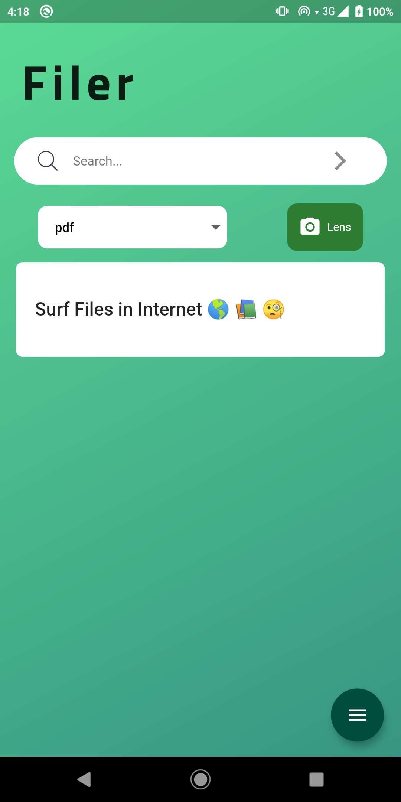

# Filer

Filer - Surf, Download and Share.

Android Apk download url : https://rb.gy/pjen6l

Direct drive link : https://drive.google.com/file/d/18XBP16DFlMxCzlfC3rFs_t7CKYcLTd8l/view?usp=drivesdk

Filer is built using flutter which uses web-scrapping to find the files of specific type in google.

Filer is an application to search internet for specific type of files like pdf,docs,xlsx,.etc. This will be most helpful for searching and downloading pdf books available on internet. And also you can share this resources to others through external apps like gmail, whatsapp, etc,.

